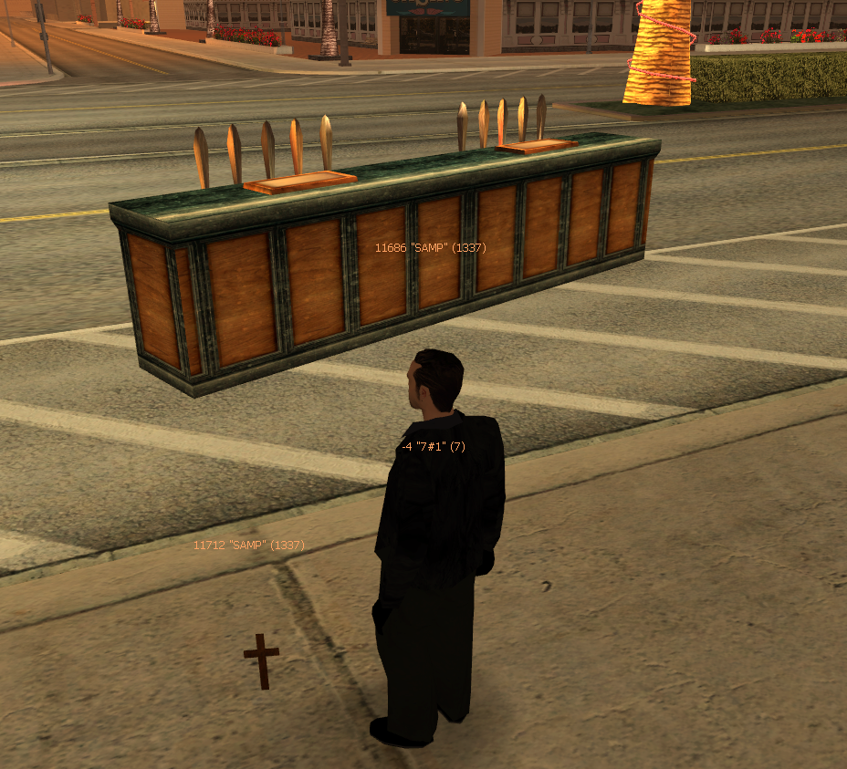

# `sampobj_red`: SA-MP Objects for Newmodels v6

With [`newmodels_red`](https://github.com/Fernando-A-Rocha/mta-add-models) (and `sampobj_red` resource) you can add all of [SA-MP's object models](https://dev.prineside.com/en/gtasa_samp_model_id/tag/2-sa-mp/) to your server, so you can use them to create custom maps, or spawn objects using Lua scripts.

## Large Size ⚠️

There are over 1,400 SA-MP object models! It is recommended to keep `download="false"` in the resource's `meta.xml` as well as `metaDownloadFalse=true` in `s_load.lua` to prevent clients from downloading all the models when they join your server.

## How to install

1. [Download](https://www.mediafire.com/file/mgqrk0rq7jrgsuc/models.zip/file) `models.zip` containing all dff/txd/col files required (total of 4,297 files; 404 MB when extracted)
2. Extract the contents of the zip to [sampobj_red/models/]([examples]/sampobj_red/models/) folder.

You're done! Newmodels will load the new models automatically when you start the `sampobj_red` resource. Their IDs are exactly the same as the IDs used in SA-MP.

You may test spawning a SA-MP object using the newmodels test commands. E.g. `11686` ([is a bar counter](https://dev.prineside.com/en/gtasa_samp_model_id/model/11686-CBarSection1/)).

## Media

