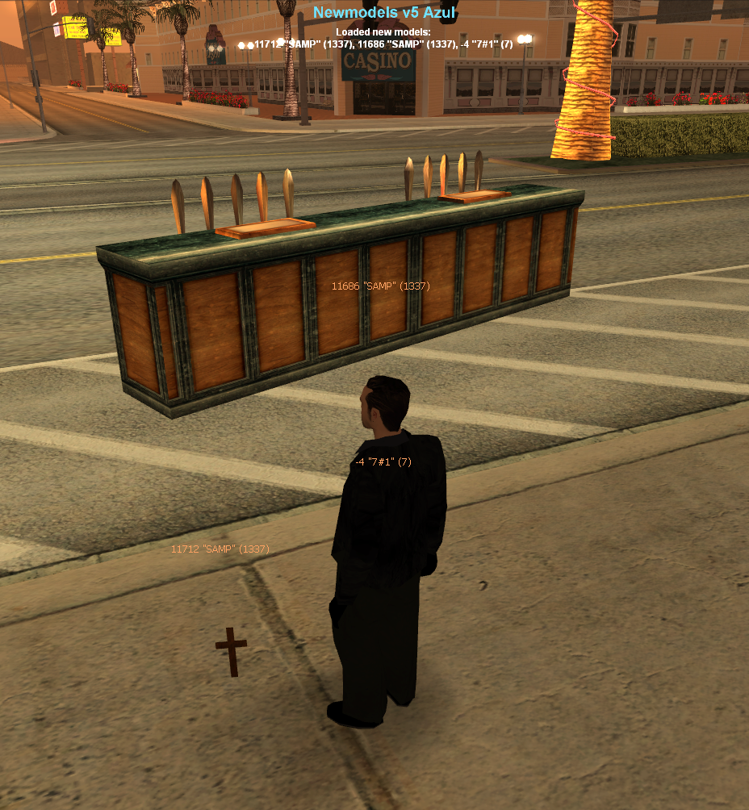

# `newmodels_azul`: SA-MP Object Models

With [`newmodels_azul`](https://github.com/Fernando-A-Rocha/mta-add-models) you can add all of [SA-MP's object models](https://dev.prineside.com/en/gtasa_samp_model_id/tag/2-sa-mp/) to your server, so you can use them to create custom maps, or spawn objects using Lua scripts.

## Attention ⚠️

There are over 1,400 SA-MP object models! It is not recommended to add all of them to your server unless you will really need them, as it will increase the download size for players.

Instead, you can add only the models you need.

## How to install

1. [Download](https://www.mediafire.com/file/mgqrk0rq7jrgsuc/models.zip/file) `models.zip` containing all dff/txd/col files required (total of 4,297 files; 404 MB when extracted)
2. Extract the contents of the zip to [newmodels_azul/models/object/1337/SAMP](/newmodels_azul/models/object/1337/SAMP/).

You're done! Newmodels will load the new models automatically when you start the resource. Their IDs are exactly the same as the IDs used in SA-MP.

You may test spawning a SA-MP object using the test command `/testobj <id>` e.g. `/testobj 11686` ([this is a bar counter](https://dev.prineside.com/en/gtasa_samp_model_id/model/11686-CBarSection1/)).

